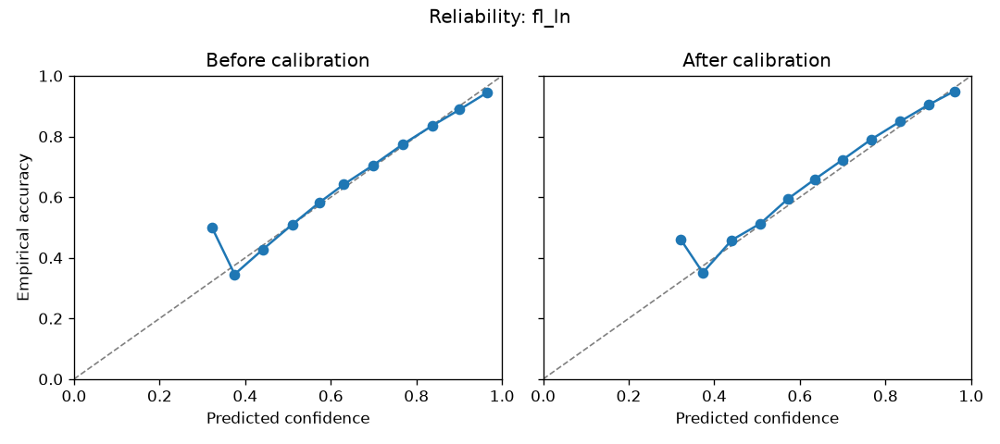
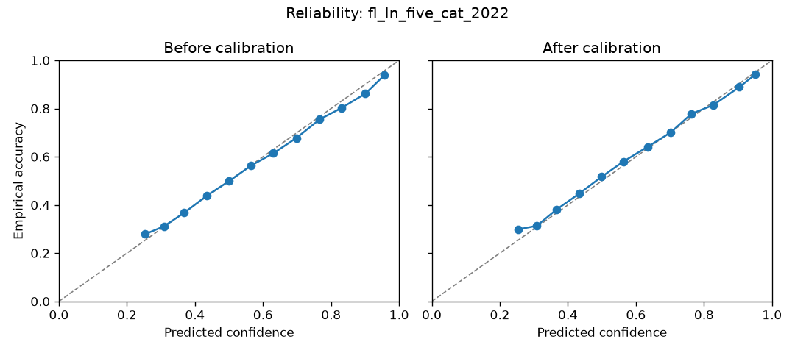
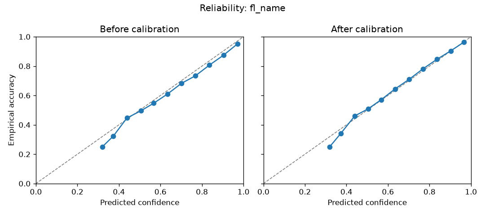
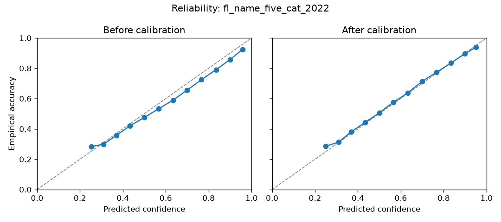
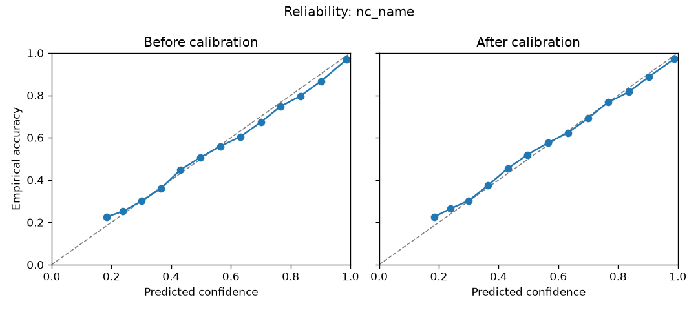

# Model cards

Every shipped model carries a stats file (`*_stats_pt.json`) with its
calibration and conformal artifacts, produced by
`scripts/model-training/calibrate_model.py` on the model's held-out data.
Methodology: see [Statistical principles](statistical_principles.md).

| Model | Classes | Accuracy | Top-3 | ECE (pre→post) | Brier | Coverage@0.90 (empirical) | Mean set size@0.90 | Temperature |
|---|---|---|---|---|---|---|---|---|
| census_2000 | 4 | 0.833 | 0.993 | 0.010→0.012 | 0.257 | 0.898 | 2.7 | 1.049 |
| census_2010 | 4 | 0.808 | 0.984 | 0.008→0.008 | 0.295 | 0.898 | 2.8 | 1.039 |
| census_2020 | 4 | 0.807 | 0.988 | 0.008→0.013 | 0.295 | 0.901 | 2.7 | 1.050 |
| fl_ln | 4 | 0.808 | 0.990 | 0.010→0.015 | 0.289 | 0.900 | 2.7 | 1.072 |
| fl_ln_five_cat | 5 | 0.586 | 0.920 | 0.010→0.016 | 0.547 | 0.899 | 3.8 | 1.083 |
| fl_ln_five_cat_2022 | 5 | 0.588 | 0.920 | 0.010→0.013 | 0.545 | 0.899 | 3.8 | 1.069 |
| fl_name | 4 | 0.843 | 0.992 | 0.024→0.006 | 0.238 | 0.901 | 2.7 | 1.149 |
| fl_name_five_cat | 5 | 0.624 | 0.938 | 0.031→0.009 | 0.502 | 0.902 | 3.5 | 1.158 |
| fl_name_five_cat_2022 | 5 | 0.626 | 0.935 | 0.033→0.008 | 0.502 | 0.899 | 3.5 | 1.160 |
| nc_name | 12 | 0.555 | 0.827 | 0.013→0.014 | 0.556 | 0.899 | 7.5 | 1.046 |
| wiki_ln | 13 | 0.775 | 0.907 | 0.015→0.018 | 0.330 | 0.901 | 8.1 | 1.015 |
| wiki_name | 13 | 0.863 | 0.954 | 0.009→0.010 | 0.205 | 0.901 | 8.0 | 1.010 |
| wiki_origin | 90 | 0.626 | 0.809 | 0.023→0.021 | 0.491 | 0.900 | 24.4 | 0.992 |

Headline findings:

- **The models are close to calibrated out of the box** (ECE ≈ 0.01–0.02,
  temperatures ≈ 1.0). This is now measured on held-out data for every
  release rather than assumed.
- **Conformal coverage is empirically on target** (within ±1pp of nominal
  at 0.80/0.90/0.95 for all models).
- **Set sizes quantify name ambiguity honestly.** A census prediction needs
  ~2.7 of 4 classes for 90% coverage; the 90-country origin model needs ~24
  — last names simply do not pin down fine-grained classes, and the sets
  say so.

## Dictionary estimators

| Estimator | Categories | Source | Coverage | License |
|---|---|---|---|---|
| census_ln / census_fn | 6 census groups | Census 2000/2010/2020 surname + 2020 first-name files | surnames ≥100 occurrences (~90% of people); first names ≥100 (~94%) | Public domain |
| pred_census_name | 6 (4 on LSTM fallback) | census tables + census LSTM fallback | see `basis` column per row | Public domain |
| pred_voter_name | 5 (white, black, hispanic, asian, other) | Rosenman-Olivella-Imai voter dictionaries (338k surnames, 136k first names) | registered voters, AL/FL/GA/LA/NC/SC | CC0 |

Dictionary probabilities are exact conditional frequencies — no calibration
step is needed; their uncertainty is sampling error (Wilson intervals for the
census tables) plus the naive-Bayes approximation for combined names (see
statistical principles).

## Evaluation weighting per model

The guarantees above refer to the population each model was evaluated on:

- **census_2000** — person (census count-weighted sample, labels drawn from census race shares)
- **census_2010** — person (census count-weighted sample, labels drawn from census race shares)
- **census_2020** — person (census count-weighted sample, labels drawn from census race shares)
- **fl_ln** — person (registered FL voter sample)
- **fl_ln_five_cat** — person, class-balanced (200k/class FL voter sample)
- **fl_ln_five_cat_2022** — person, class-balanced (200k/class FL voter sample)
- **fl_name** — person (registered FL voter sample)
- **fl_name_five_cat** — person, class-balanced (200k/class FL voter sample)
- **fl_name_five_cat_2022** — person, class-balanced (200k/class FL voter sample)
- **nc_name** — person-reinflated (pre-dedup NC voter frequency)
- **wiki_ln** — unique notable person (Wikipedia/Wikidata)
- **wiki_name** — unique notable person (Wikipedia/Wikidata)

## Reliability diagrams

### census_2000

### census_2010

### census_2020

### fl_ln

### fl_ln_five_cat

### fl_ln_five_cat_2022

### fl_name

### fl_name_five_cat

### fl_name_five_cat_2022

### nc_name

### wiki_ln

### wiki_name

