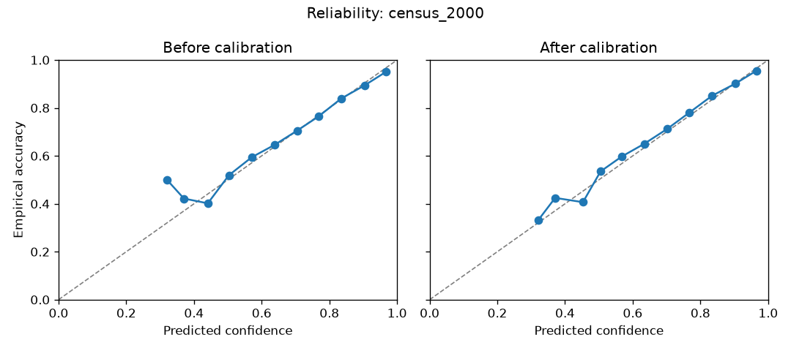
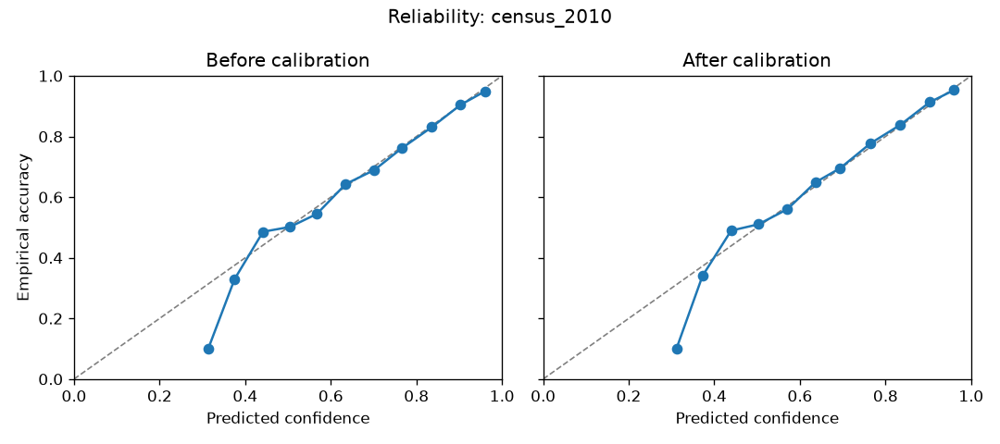
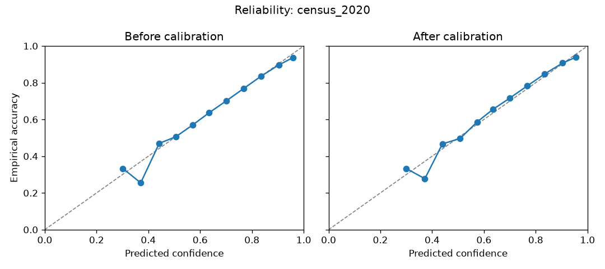
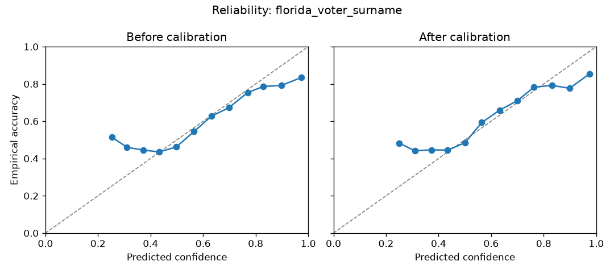
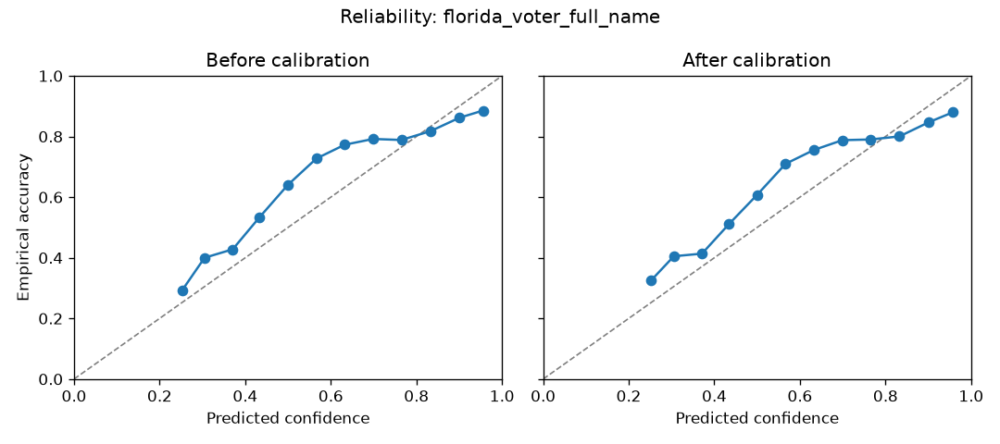
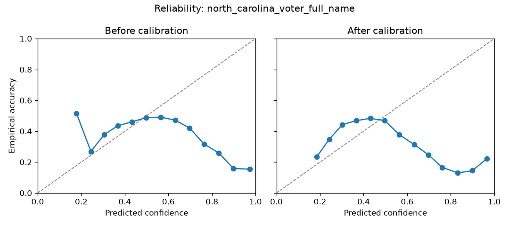
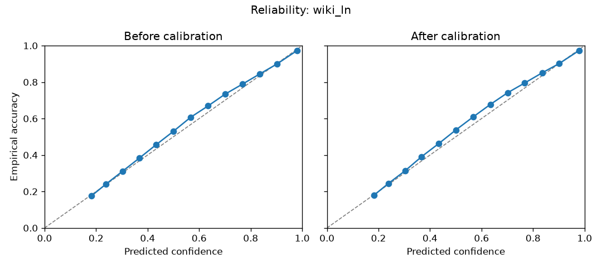
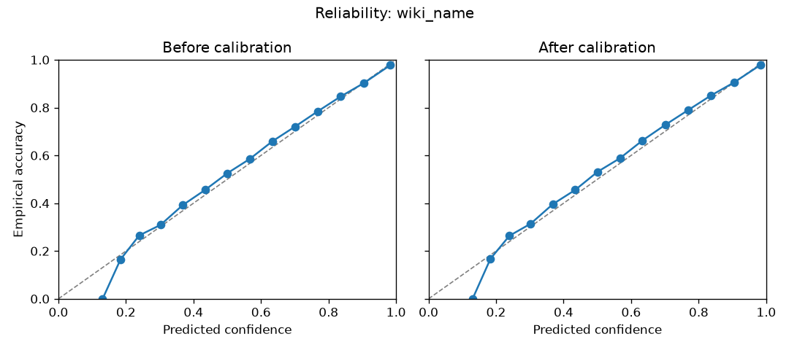

# Model cards

Every shipped model carries a stats file (`*_stats_pt.json`) with its
calibration and conformal artifacts, produced by
`scripts/model-training/calibrate_model.py` on the model's held-out data.
Methodology: see [Statistical principles](statistical_principles.md).

| Model | Classes | Top-1 | Top-3 | Observed 90% coverage | Mean set size |
| --- | ---: | ---: | ---: | ---: | ---: |
| Census 2000 surname | 4 | 0.833 | 0.993 | 0.898 | 2.7 |
| Census 2010 surname | 4 | 0.808 | 0.984 | 0.898 | 2.8 |
| Census 2020 surname | 4 | 0.807 | 0.988 | 0.901 | 2.7 |
| Florida voter surname | 5 | 0.588 | 0.947 | 0.900 | 3.9 |
| Florida voter full name | 5 | 0.677 | 0.948 | 0.900 | 3.6 |
| North Carolina voter full name | 12 | 0.425 | 0.896 | 0.903 | 4.7 |
| Wikipedia/Wikidata surname | 13 | 0.775 | 0.907 | 0.901 | 8.1 |
| Wikipedia/Wikidata full name | 13 | 0.863 | 0.954 | 0.901 | 8.0 |
| Wikipedia/Wikidata origin | 90 | 0.626 | 0.809 | 0.900 | 24.4 |

Florida and North Carolina were retrained for 2.0 after an audit found source
overlap in the earlier evaluation splits. The new artifacts split source rows
before balancing and learn vocabulary only from training rows. The old numbers
are not used as evidence.

Each JSON artifact contains the complete calibration record, including ECE,
Brier score, temperature, all supported coverage levels, and reliability bins.
The table keeps only the quantities most useful for choosing an estimator.

Set sizes show how much ambiguity remains. A Census estimate needs about 2.7
of 4 classes for 90% coverage; the 90-country origin model needs about 24.
Last names do not identify fine-grained classes.

## Dictionary estimators

| Estimator | Categories | Source | Coverage | License |
|---|---|---|---|---|
| lookup_census_surname / lookup_census_first_name | 6 census groups | Census 2000/2010/2020 surname + 2020 first-name files | surnames ≥100 occurrences (~90% of people); first names ≥100 (~94%) | Public domain |
| estimate_census_full_name | 6 (4 on surname-model fallback) | census tables + census surname-model fallback | see `evidence_basis` column per row | Public domain |
| estimate_voter_file_full_name | 5 (white, black, hispanic, asian, other) | six-state voter-file name dictionary (338k surnames, 136k first names) | registered voters, AL/FL/GA/LA/NC/SC | CC0 |

Dictionary probabilities are exact conditional frequencies. No calibration
step is needed; their uncertainty is sampling error (Wilson intervals for the
census tables) plus the naive-Bayes approximation for combined names (see
statistical principles).

## Evaluation populations

Metrics are not directly comparable across data sources. Census evaluation is
person-weighted. Florida evaluation represents registered voters. North
Carolina evaluation restores pre-deduplication voter frequency. Wikipedia and
Wikidata evaluation represents unique notable people. Each stats file records
the exact evaluation procedure.

## Reliability diagrams

### Census 2000 surname

### Census 2010 surname

### Census 2020 surname

### Florida voter surname

### Florida voter full name

### North Carolina voter full name

### Wikipedia/Wikidata surname

### Wikipedia/Wikidata full name

